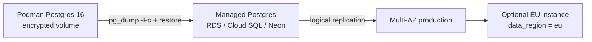

# Data Security & Compliance

**Product:** SpendFlow  
**Last Updated:** May 2026

Covers secure storage of customer accounts, Plaid connection details, financial data, regional privacy obligations, and database strategy for self-hosted → cloud migration.

---

## Data classification

| Data | Classification | Stored where | At-rest protection |
|------|----------------|--------------|-------------------|
| Plaid `access_token` | **Critical secret** | Backend PostgreSQL only | AES-256-GCM + envelope encryption (KMS in cloud) |
| Bank login credentials | **Never stored** | Plaid OAuth only | N/A |
| Transactions, balances | **Sensitive financial PII** | PostgreSQL | DB volume encryption + TLS in transit |
| Uploaded statement files (pre-parse) | **Sensitive financial PII** | PostgreSQL `import_files.content_encrypted` | AES-256-GCM per file; purged after parse (≤24h) |
| Email, user profile | **PII** | PostgreSQL | Same |
| JWT refresh token | **High** | Web: httpOnly cookie; iOS: Keychain | OS / cookie flags |
| JWT access token | **Medium** | Memory only (short TTL) | N/A |
| APNs device token | **Medium** | PostgreSQL `devices` table | Standard DB security |
| Plaid webhook payloads | **Transient** | Process in memory; log metadata only | N/A |

**Rule:** Plaid `access_token`, `PLAID_SECRET`, `ENCRYPTION_KEY`, and `DATABASE_URL` never appear in `ui/`, `ios/`, logs, analytics, or crash reports. Uploaded statement **file contents** are never logged — only batch id, byte size, and format metadata.

### Uploaded statement files

```
User upload (TLS) → API validates + encrypts (AES-256-GCM, import salt)
  → import_files.content_encrypted
  → worker decrypts in memory → parse → transactions / investment_transactions
  → delete encrypted blob (retention ≤24h, configurable)
```

See [statement-import-ui-and-security.md](../design/statement-import-ui-and-security.md).

---

## Encryption strategy

### Phase 1 — Self-hosted (Podman)

```
Plaid access_token
  → AES-256-GCM(ENCRYPTION_KEY, random IV per row)
  → plaid_items.access_token_encrypted

PostgreSQL data directory
  → LUKS / dm-crypt encrypted volume

Backups
  → pg_dump to encrypted object storage (age or GPG)
```

### Phase 2 — Cloud migration

```
Plaid access_token
  → AES-256-GCM(DEK per user or per row)
  → DEK wrapped by KEK in AWS KMS / GCP Cloud KMS / HashiCorp Vault
  → plaid_items.access_token_encrypted + access_token_key_id (KMS key version)
```

Key rotation: re-encrypt rows with new DEK/KEK; track `access_token_key_id` for audit.

---

## Plaid & processor obligations

- Plaid is a **data processor** — disclose in privacy policy; user consent required before Link
- Data use limited to user-permissioned personal finance (Plaid ToS) — no resale, no unrelated advertising
- On account deletion: revoke Plaid item via API, then delete local rows
- Webhook endpoints: verify HMAC-SHA256 on every request before enqueueing work

---

## Regional privacy frameworks

SpendFlow processes personal financial data. Obligations vary by user location.

| Region | Framework | Key requirements |
|--------|-----------|------------------|
| US (California) | CCPA / CPRA | Right to delete, know, correct; privacy notice; no sale of personal information |
| US (general) | Industry practice | Strong security for financial PII; Plaid handles bank credentials |
| EU / EEA | GDPR | Lawful basis (consent), erasure, portability, data minimization, breach notification (72h), processor DPAs |
| UK | UK GDPR | Align with GDPR |
| Canada | PIPEDA | Consent, breach notification, accountability |
| Australia | Privacy Act (APPs) | Privacy policy, secure handling, notifiable breaches |

### Product features that satisfy common obligations

| Obligation | Implementation |
|------------|----------------|
| Consent | Explicit checkbox at signup + before first Plaid Link; store in `consent_records` |
| Right to erasure | `DELETE /users/me` — revoke Plaid items, cascade delete DB rows |
| Right to portability | CSV export + `GET /auth/export` JSON (GDPR/CCPA) |
| Right to know | Privacy policy + in-app data summary screen (V2) |
| Breach response | Documented playbook with 72h EU notification timeline |
| Sub-processors | Published list: Plaid, cloud host, push/email provider |

---

## Data residency

Add to schema **before** first production user (cheap now, expensive to retrofit):

```sql
users (
  ...
  country_code TEXT,              -- ISO 3166-1 alpha-2, from signup or IP hint
  data_region TEXT NOT NULL DEFAULT 'us'  -- 'us' | 'eu' | ...
)
```

| Phase | Strategy |
|-------|----------|
| **1** | Single PostgreSQL instance (home region) |
| **2** | Migrate to managed cloud Postgres (same region) |
| **3** | Separate Postgres per region for `data_region = 'eu'` users |
| **4** | EU open banking via Tink / TrueLayer / Plaid EU where required |

Plaid is US-centric today. EU expansion requires evaluating aggregators beyond Plaid.

---

## Database choice: PostgreSQL

PostgreSQL 16 remains the primary store. It satisfies finance, security, compliance, and migration requirements.

| Requirement | Why PostgreSQL |
|-------------|----------------|
| Relational model | Accounts, transactions, transfer pairs, reconciliation joins |
| Row Level Security | Enforce `user_id` scope at DB layer for multi-tenant safety |
| ACID | Sync jobs and reconciliation must not leave partial corrupt state |
| Portability | Identical on Podman, AWS RDS, GCP Cloud SQL, Azure, Neon, Supabase |
| Migration | `pg_dump`, logical replication — no vendor lock-in |
| Drizzle ORM | Schema-as-code migrations travel with the app |
| Audit | Append-only `audit_events` table, triggers optional |
| Encryption | Self-hosted LUKS → managed transparent data encryption (TDE) in cloud |

**Do not** use MongoDB, Firebase, or client-local DB as the primary store for Plaid tokens or transactions.

Optional **encrypted offline cache** on iOS (Core Data / SQLite) is read-only and must not store Plaid access tokens.

---

## Schema additions for compliance

Extend core schema from [system-overview.md](system-overview.md):

```sql
-- Consent tracking (GDPR)
consent_records (
  id UUID PRIMARY KEY,
  user_id UUID REFERENCES users(id),
  consent_type TEXT NOT NULL,     -- 'terms' | 'privacy' | 'plaid_link'
  version TEXT NOT NULL,          -- policy version string
  granted_at TIMESTAMPTZ NOT NULL,
  ip_address INET,
  user_agent TEXT
)

-- Audit trail (token access, login, export, delete)
audit_events (
  id UUID PRIMARY KEY,
  user_id UUID,
  action TEXT NOT NULL,           -- 'plaid_token_decrypt' | 'login' | 'export' | 'delete'
  resource_type TEXT,
  resource_id UUID,
  metadata JSONB,
  ip_address INET,
  created_at TIMESTAMPTZ DEFAULT NOW()
)

-- Push device registration (iOS)
devices (
  id UUID PRIMARY KEY,
  user_id UUID REFERENCES users(id),
  platform TEXT NOT NULL,         -- 'ios' | 'web'
  apns_token TEXT,
  created_at TIMESTAMPTZ DEFAULT NOW(),
  last_seen_at TIMESTAMPTZ
)

-- Erasure proof (optional tombstone after hard delete)
deleted_users (
  id UUID PRIMARY KEY,
  former_user_id UUID NOT NULL,
  deleted_at TIMESTAMPTZ DEFAULT NOW(),
  request_source TEXT             -- 'user' | 'admin' | 'ccpa'
)
```

Extend `plaid_items`:

```sql
access_token_key_id TEXT          -- KMS key version for envelope encryption
```

Extend `users`:

```sql
country_code TEXT,
data_region TEXT NOT NULL DEFAULT 'us'
```

---

## Cloud migration path



### Migration checklist

1. Provision managed PostgreSQL 16 (same major version).
2. `pg_dump -Fc` from Podman → restore to cloud instance.
3. Update backend `DATABASE_URL`; run smoke tests.
4. Enable automated backups and point-in-time recovery.
5. Move `ENCRYPTION_KEY` to KMS envelope encryption.
6. Restrict Postgres to private network / VPC; no public host port.
7. Document RPO/RTO and backup retention (e.g. 30-day PITR).

Redis migrates similarly to ElastiCache, Upstash, or Redis Cloud.

---

## Operational security checklist

- [ ] TLS 1.3 on all public endpoints
- [ ] Rate limiting: 100 req/min/user (Redis sliding window)
- [ ] Webhook HMAC verification (Plaid)
- [ ] Row-level security or mandatory `user_id` filter on every query
- [ ] Audit log for Plaid token decrypt events
- [ ] Secrets via env / Podman secrets / cloud secret manager — never in git
- [ ] Non-root containers (API, worker, UI)
- [ ] Postgres not exposed on host in production
- [ ] Encrypted backups with tested restore procedure
- [ ] Incident response runbook with regional notification timelines
- [ ] iOS: Keychain for refresh tokens; optional certificate pinning
- [ ] No financial PII in Sentry breadcrumbs or unstructured logs

---

## Related documents

- [system-overview.md](system-overview.md)
- [mobile-ios.md](mobile-ios.md)
- [container-deployment.md](container-deployment.md)
- [api-contract.md](../design/api-contract.md)
